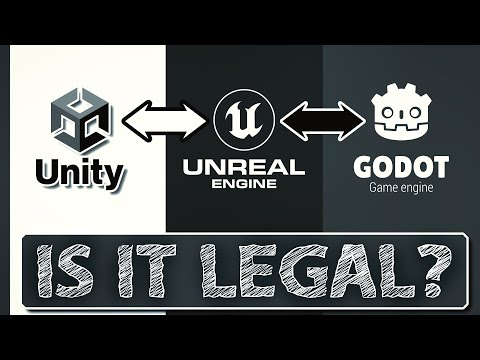

# Unity To RebelFork

## Is it legal?

Here is something you should read or watch on YouTube before proceeding:

## Dependencies

The project has LightInject as a embedded dependency.

## Installation

The main exporter package name is io.rebelfork.unityexporter. You can find it in Releases section of this github project.

Use [Package Manger](https://docs.unity3d.com/Manual/upm-ui.html) to add this package to your Unity project.

## Setup

First you need to create ExportSettings in the assets of your project. This asset going to hold all export settings for the project.

When selecting the asset you'll see the following in the Inspector window:

Path defines path to the Data folder of your project. You can use "Pick folder" button to select it from popup dialog window. "Open folder" will reveal the folder in Explorer/Finder.

"Export current scene" button starts the export of the current scene and all related assets into target folder.