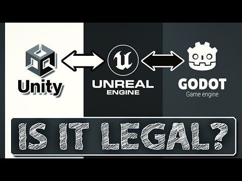

# Unity To RebelFork

This is an experimental (work in progress) tool to convert Unity3D assets to a format that RebelFramework can read.

Exporting assets from Unity to other game engines is a common practice among game developers. This is because Unity provides a wide range of tools and features that make it easy to create high-quality assets. However, Unity may not be the best engine for every game development project. For example, some developers may prefer RebelFork for its open-source nature and ease of use.

Here is something you should read or watch on YouTube before proceeding:

# Documentation

[Documentation](Documentation~/README.md)